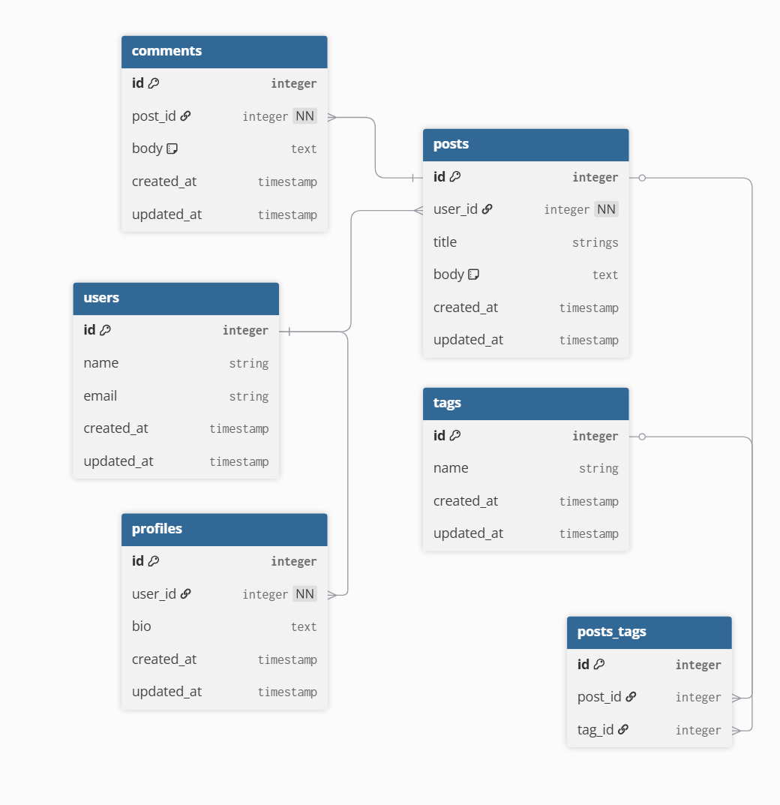

## EctoAssoc       
    
Find out more in Hex [documentation](https://hexdocs.pm/ecto/associations.html?source=post_page-----7b98bdb7f2a4---------------------------------------)    

We’ll model a simple **blogging system** with the following <ins>relationships</ins>:
- A **User** <ins>has one</ins> `Profile`.     
- A **User** <ins>has many</ins> `Posts`.    
- A `Post` <ins>belongs to</ins> a **User** and <ins>has many</ins> `Comments`.    
- A `Comment` <ins>belongs to</ins> a `Post`.    
- A `Post` <ins>has many</ins> `Tags` and vice versa (<ins>many-to-many</ins>).     
- A **User** <ins>has many</ins> `Tags` <ins>through</ins> `Posts` (*indirect association*).    
     
     
     
Link to entity [document](https://dbdiagram.io/d/Blog-schema-687e3c61f413ba3508e43c31)  

## 1. Define Schemas      

```bash
# create `context`, `schema` and `migration`
$ mix phx.gen.context Accounts User users name:string email:string

# create `context`, `schema` and `migration` 
# (one to one | `profile` belongs_to a `user`)
$ mix phx.gen.context Accounts Profile profiles bio:text user_id:references:users

# create `context`, `schema` and `migration` 
# (one to many | `user` has_many `posts`)
$ mix phx.gen.context Blog Post posts title:string body:text user_id:references:users

# create `context`, `schema` and `migration`
# (one to one | `comment` belongs_to a `post`)
$ mix phx.gen.context Blog Comment comments body:text post_id:references:posts

# create `context`, `schema` and `migration`
$ mix phx.gen.context Blog Tag tags name:string
```          
    

## 2. Many-to-many join table       

For the <ins>many-to-many</ins> relationship between `Post` and `Tag` we need a join table.   
```bash
$ mix ecto.gen.migration create_posts_tags
```      
Edit the migration file to include:
```elixir
def change do
  create table(:posts_tags) do
    add :post_id, references(:posts, on_delete: :delete_all)
    add :tag_id, references(:tags, on_delete: :delete_all)
  end

  create unique_index(:posts_tags, [:post_id, :tag_id])
end
```     
Run the migration `$ mix ecto.create`      
     
## 3. Define Associations in Scehmas     
     
**lib/ecto_assoc/accounts/user.ex**     
```elixir
defmodule MyApp.Accounts.User do
  use Ecto.Schema
  import Ecto.Changeset
  
  schema "users" do
    field :name, :string
    field :email, :string

    has_one :profile, EctoAssoc.Accounts.Profile
    has_many :posts, EctoAssoc.Blog.Post
    has_many :tags, through: [:posts, :tags]   # `through` association
    timestamps()
  end

  def changeset(user, attrs) do
    user
    |> cast(attrs, [:name, :email])
    |> validate_required([:name, :email])
    |> unique_constraint(:email)
  end

end
```        
     
**lib/ecto_assoc/accounts/profile.ex**     
```elixir
defmodule EctoAssoc.Accounts.Profile do
  use Ecto.Schema
  import Ecto.Changeset

  schema "profiles" do
    field :bio, :string

    belongs_to :user, EctoAssoc.Accounts.User
    timestamps()
  end

  def changeset(profile, attrs) do
    profile
    |> cast(attrs, [:bio, :user_id])
    |> validate_required([:bio, :user_id])
    |> assoc_constraint(:user)
  end
end
```           
     
**lib/ecto_assoc/accounts/post.ex**     
```elixir
defmodule EctoAssoc.Blog.Post do
  use Ecto.Schema
  import Ecto.Changeset

  schema "posts" do
    field :title, :string
    field :body, :string

    belongs_to :user, EctoAssoc.Accounts.User
    has_many :comments, EctoAssoc.Blog.Comment
    many_to_many :tags, EctoAssoc.Blog.Tag, join_through: "posts_tags"

    timestamps(type: :utc_datetime)
  end

  def changeset(post, attrs) do
    post
    |> cast(attrs, [:title, :body, :user_id])
    |> validate_required([:title, :body, :user_id])
    |> assoc_constraint(:user)
  end
end
```              
     
**lib/ecto_assoc/accounts/comment.ex**     
```elixir
defmodule EctoAssoc.Blog.Comment do
  use Ecto.Schema
  import Ecto.Changeset

  schema "comments" do
    field :body, :string

    belongs_to :post, EctoAssoc.Blog.Post

    timestamps()
  end

  def changeset(comment, attrs) do
    comment
    |> cast(attrs, [:body, :post_id])
    |> validate_required([:body, :post_id])
    |> assoc_constraint(:post)
  end
end
```              
          
**lib/ecto_assoc/accounts/tag.ex**     
```elixir
defmodule EctoAssoc.Blog.Tag do
  use Ecto.Schema
  import Ecto.Changeset

  schema "tags" do
    field :name, :string

    many_to_many :posts, EctoAssoc.Blog.Post, join_through: "posts_tags"
    has_many :users, through: [:posts, :user]  # `through` association

    timestamps()
  end

  def changeset(tag, attrs) do
    tag
    |> cast(attrs, [:name])
    |> validate_required([:name])
    |> unique_constraint(:name)
  end
end
```    
     
> **Explanation of `through` associations:**   
>  
> In the `User` schema, `has_many: tags, through: [:posts, :tags]` establish an indirect association, allowing a **user** to access all the tags associated with their posts. 
>    
> Similarly, in the `Tag` schema, `has_many :users, through: [:posts, user]` allows a **tag** to access all the users who have posts tagged with it.     
     
## 4. Preloading associations    
To efficiently fetch associated data, Ecto provides the `preload()` function.     

**Fetching a `Post` with `Comments` and `Tags`:**         
```elixir
def get_post!(id) do
  Repo.get!(Post, id)
  |> Repo.preload([:comments, :tags, :user])
end     
```     
    
**Fetching a `User` with `Profile`, `Posts`, and `Tags`:**    
```elixir
def get_user!(id) do
  Repo.get!(User, id)
  |> Repo.preload([:profile, :posts, :tags])
end
```     
    
**Fetching a `Tag` with `Users`:**    
```elixir
def get_tag!(id) do
  Repo.get!(Tag, id)
  |> Repo.preload([:posts, :users])
end
```        
     
## 5. Building and Updating Associations    
Ecto allows you to build and update associated records seamlessly.    
     
**Creating a `User` with `Profile`:**     
```elixir
%User{}
|> User.changeset(%{name: "Jane Doe", email: "jane@example.com"})
|> Ecto.Changeset.cast_assoc(:profile, with: &Profile.changeset/2)
|> Repo.insert()
```         
     
**Adding `Tags` to a `Post`:**     
```elixir
post = Repo.get!(Post, post_id) |> Repo.preload(:tags)
tags = Repo.all(from t in Tag, where: t.name in ["elixir", "phoenix"])

changeset =
  Post.changeset(post, %{})
  |> Ecto.Changeset.put_assoc(:tags, tags)

Repo.update(changeset)
```         
     
**Accessing `User`'s `Tags` through `Posts`:**     
```elixir
def get_user_tags(user_id) do
  user = Repo.get!(User, user_id) |> Repo.preload(:tags)
  user.tags
end
```     

To start your Phoenix server:

  * Run `mix setup` to install and setup dependencies
  * Start Phoenix endpoint with `mix phx.server` or inside IEx with `iex -S mix phx.server`

Now you can visit [`localhost:4000`](http://localhost:4000) from your browser.

Ready to run in production? Please [check our deployment guides](https://hexdocs.pm/phoenix/deployment.html).

## Learn more

  * Official website: https://www.phoenixframework.org/
  * Guides: https://hexdocs.pm/phoenix/overview.html
  * Docs: https://hexdocs.pm/phoenix
  * Forum: https://elixirforum.com/c/phoenix-forum
  * Source: https://github.com/phoenixframework/phoenix
