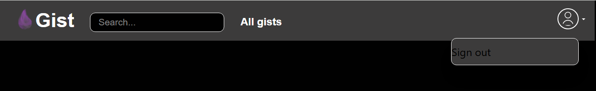

### Gist   
    
```bash
$ mix phx.new elixir_gist --no-install --binary-id

$ mix deps.get

$ mix phx.gen.auth Accounts User users  # press `Y` for `Do you want to create a LiveView based authentication system?` 

# Go to `http://localhost:4000/dev/mailbox` and confirm your email by clicking the given link in that page

$ mix ecto.setup   # its a collection of two commands `mix ecto.create` and `mix ecto.migrate`

$ mix phx.gen.context Gists Gist gists user_id:references:users name:string description:text markup_text:text    

$ mix phx.gen.context Gists SavedGist savedgists user_id:references:users gist_id:references:gists  

$ mix phx.gen.context Comments Comment comments user_id:references:users gist_id:references:gists markup_text:text

$ mix ecto.migrate
```    
     
### Recover Postgres Docker passowrd      
```bash
$ docker ps    

# here your `NAMES` (i.e. `bs_db_local`) from above command
# Scroll up to find `Env` variable and your `POSTGRES_USER/PASSWORD`
$ docker inspect bs_db_local   
```    

## Change CSS     
    
## Dont load `lib/elixir_gist_web/componenets/layouts/app.html.heex`      
## Only load `lib/elixir_gist_web/controllers/page_html/home.html.heex`    
Keep `layout: false` in `render(conn, :home, layout: false)`   
    
## Load `lib/elixir_gist_web/componenets/layouts/app.html.heex`      
## Load `lib/elixir_gist_web/controllers/page_html/home.html.heex`     
Remove `layout: false` in `render(conn, :home)`  

Delete all the content of `lib/elixir_gist_web/componenets/layouts/app.html.heex` and `lib/elixir_gist_web/controllers/page_html/home.html.heex`    

And keep the content in `lib/elixir_gist_web/componenets/layouts/root.html.heex` as follows:      
```html
<!DOCTYPE html>
<html lang="en" class="[scrollbar-gutter:stable]">
  <head>
    <meta charset="utf-8" />
    <meta name="viewport" content="width=device-width, initial-scale=1" />
    <meta name="csrf-token" content={get_csrf_token()} />
    <.live_title default="ElixirGist" suffix=" · Elixir Gist">
      {assigns[:page_title] || "Home"}
    </.live_title>
    <link phx-track-static rel="stylesheet" href={~p"/assets/app.css"} />
    <script defer phx-track-static type="text/javascript" src={~p"/assets/app.js"}>
    </script>
  </head>
  <body class="bg-emDark-dark">
    {@inner_content}
  </body>
</html>
```          
    
## Change the Application Name globaly    
In above `heex` code snippet, in `<.live_title>` component, change the `suffix` to reflect your **App Name**    
```elixir
<.live_title default="ElixirGist" suffix=" · Elixir Gist">
  {assigns[:page_title] || "Home"}
</.live_title>
```    
     
## Add the tailwind css class "bg-emDark-dark"   
classes we added in `/assets/tailwind.config.js` as follows, give `"bg-emDark-dark"` class to `body` html in `root.html.heex`    
```html
<body class="bg-emDark-dark">
  {@inner_content}
</body>
```     
    
## Classes in `/assets/tailwind.config.js`  
CSS Classes for websites, fonts, and background are defined inside `module.exports = {}` in `/assets/tailwind.config.js` as follows:    
```js
module.exports = {
  content: [
    "./js/**/*.js",
    "../lib/elixir_gist_web.ex",
    "../lib/elixir_gist_web/**/*.*ex"
  ],

  theme: {
    extend: {
      colors: {
        emDark: {   
          dark: "#010101",
          DEFAULT: "#3C3B3B",
          light: "#828282",
        },
        emPurple: {
          dark: "#631A61",
          DEFAULT: "#A834A5",
          light: "#E88FE5"
        },
        emLavender: {
          dark: "#8C52FF",
          DEFAULT: "#9D74EE",
          light: "#BC9AFF"
        }
      },
      fontFamily: {
        brand: ["WorkSans", "sans-serif"],
      },
      fontWeight: {
        regular: "normal",
        bold: "bold"
      }
    },
  },

  plugins: [
    ...
    ...
    ...
  ]
}  
``` 

And now add font into `assets/css/app.css`   
```css
@font-face {
  font-family: "WorkSans";
  src: url("/fondts/WorkSans-Regular.ttf");
  font-weight: normal;
  font-style: normal;
}

@font-face {
  font-family: "WorkSans";
  src: url("/fondts/WorkSans-Bold.ttf");
  font-weight: bold;
  font-style: normal;
}
```       
    
## Change `app.html.heex` file to    
```html
<header class="flex justify-between items-center px-6 py-3 bg-emDark">
  <div class="flex relative">
    <a href={~p"/"}>
      
    </a>
    <a href={~p"/"} class="mr-6">
      <div class="text-white font-brand font-bold text-3xl">Gist</div>
    </a>
    <div>
      <input 
        type="text" 
        class="rounded-lg focus:outline-none focus:border-emLavender focus:ring-0 px-3 py-1 bg-emDark-dark placeholder-emDark-light text-white font-brand font-regular text-sm mr-5 border-white" 
        placeholder="Search..."
      />
      <button class="mt-2 mr-2 text-white text-[1rem] font-brand font-bold hover:text-emDark-light">All gists</button>
    </div>
  </div>

  <div class="relative">
    <button class="img-down-arrow" type="button" id="user-menu-button">
      
    </button>
    <div 
      id="dropdown_menu" 
      class="absolute right-0 mt-2 py-2 w-48 bg-emDark rounded-lg shadow-xl border border-white"
    >
    </div>
  </div>
</header>
```    
    
    


To start your Phoenix server:

  * Run `mix setup` to install and setup dependencies
  * Start Phoenix endpoint with `mix phx.server` or inside IEx with `iex -S mix phx.server`

Now you can visit [`localhost:4000`](http://localhost:4000) from your browser.

Ready to run in production? Please [check our deployment guides](https://hexdocs.pm/phoenix/deployment.html).

## Learn more

  * Official website: https://www.phoenixframework.org/
  * Guides: https://hexdocs.pm/phoenix/overview.html
  * Docs: https://hexdocs.pm/phoenix
  * Forum: https://elixirforum.com/c/phoenix-forum
  * Source: https://github.com/phoenixframework/phoenix
