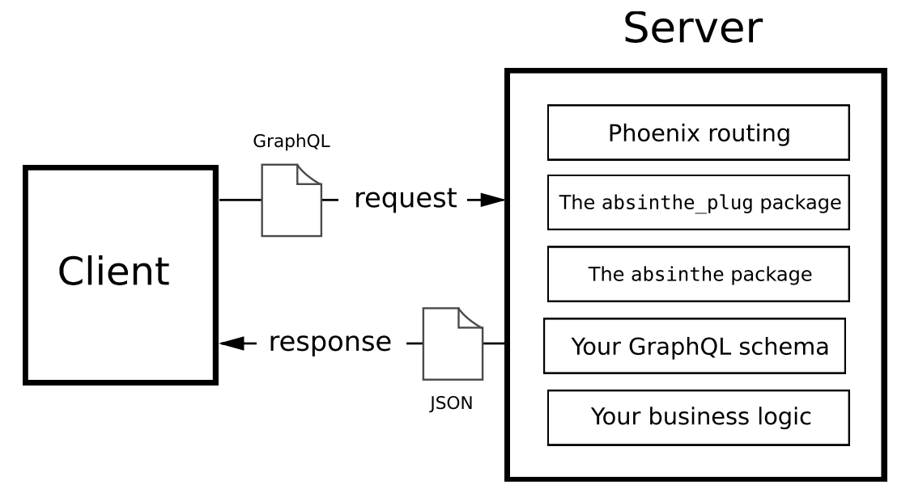

### PlateSlate     
    
- Asking Graphql server to provide information calls `query`.
- Persisting a change to data is called `mutation`
- Requesting live feed of data is `subscription`    

    
 ```bash
$ mix phx.new plate_slate --no-install --adapter cowboy
 ```   

 ### Dependencies added 
```elixir
  {:absinthe, "~> 1.7"},
  {:absinthe_plug, "~> 1.5"},
  {:absinthe_phoenix, "~> 2.0"},
  {:absinthe_relay, "~> 1.5"}
```
    
* Install dependencies with `mix deps.get`
* Create and migrate your database with `mix ecto.setup`      

    
    
 GraphQL schemas are more than just structural metadata and actually define behavior, they’re the API implementation itself.    
    
To build a GraphQL API, you’ll need to construct a GraphQL schema `lib/plate_slate_web/schema.ex`, which defines its domain model and how data is retrieved.     

**Query** from client look as follows:
```graphql
{
  menuItems {
    name 
  }
}
```     
- A GraphQL query is the way that API users can ask for specific pieces of information. to support users getting menu items, we need to provide two things:
  - A way for users to request objects of the type
  - A way for the system to retrieve (or resolve) the associated data
    
**Response** from server will look as follow:
```elixir
{
  "data": {
    "menuItems": [
      {"name": "Reuben"},
      {"name": "Croque Monsieur"}, {"name": "Muffuletta"}
    ] 
  }
}
```    
    
### Reviewing object  
Run `iex -S mix` and then type `Absinthe.Schema.lookup_type(PlateSlateWeb.Schema, "MenuItem")`    
    
`list_of()` is a handy macro, defined by Absinthe, which is short for `%Absinthe.Type.List{of_type: :menu_item}`.  

As GraphQL often used by front-end languages like JavaScript. Hence elixir `:menu_items` is automatically translated by Absinthe into `menuItems` which Javascript expects     

Our `:menu_items` field in `lib/plate_slate_web/schema.ex` doesn't actually build the list of menu items yet (as shown below.) 
```elixir
  query do
    field :menu_items, list_of(:menu_item)
  end
```  
> To build the list of menu items, we have to retrieve the data for the field. GraphQL refers to this as **resoultion**. A field’s resolver is the function that runs to retrieve the data needed for a particular field (which uses `Repo.all(PlateSlate.Menu.Item)`).    
   
```elixir
  alias PlateSlate.{Menu, Repo}

  query do
    field :menu_items, list_of(:menu_item) do
      resolve fn _, _, _ ->
        {:ok, Repo.all(Menu.Item)}
      end
    end
  end
```   
   
You don't need to define a resolver function for every field. For example, this query will attempt to resolve a menu item’s `:name` field:  
```graphql
{
  menuItems {
    name
  }
}
```  
    
If a resolver is not defined for a field, Absinthe will attempt to use the equivalent of `Map.get/2` to retrieve a value from the parent value in scope, using the identifier for the field.   

Resolution starts at the root of a documents and works its way deeper, with each field resolver's return value acting as the parent value for its child fields. Because the resolver for menuItems (that is, the resolver we defined in our schema for the `:menu_items` field) returns a list of menu item values and resolution is done for each item in a list—the parent value for the name field is a menu item value. Our query, in fact, boils down to something very close to this:    

```elixir
for menu_item <- PlateSlate.Repo.all(PlateSlate.Menu.Item) do
  Map.get(menu_item, :name)
end
```      

> Absinthe integrates with three versions of GraphiQL: the [official interface](https://github.com/graphql/graphiql), an [advanced version](https://github.com/OlegIlyenko/graphiql-workspace), and [GraphQL Playground](https://github.com/graphcool/graphql-playground). All three are built in to the `absinthe_plug` package (already in `mix.exs` file) and ready to go with just a little configuration. We need Phoenix router to user it.   
```elixir
scope "/" do
  pipe_through :api

  forward "/api", Absinthe.Plug,
    schema: PlateSlateWeb.Schema

  forward "/graphiql", Absinthe.Plug.GraphiQL,
    schema: PlateSlateWeb.Schema,
    interface: :simple
end
```     
    
## Run GraphiQL    
    
Run `mix phx.server` and visit `http://localhost:4000/graphiql`.  

Now you can write following (you can also ommit keyword `query` by default it is understood).  

```graphql
query {
  menuItems {
    id
    name
  }
}
```         

## Run Test.   

`$ mix test test/plate_slate_web/schema/query/menu_items_test.exs`       
    
## Test variables 

```grapql
query ($term: String) {
  menuItems(matching: $term) {
    name
  }
}
```    
- give variable value like following.   
    
```json
{"term": "reu"}
```    

    


To start your Phoenix server:

  * Run `mix setup` to install and setup dependencies
  * Start Phoenix endpoint with `mix phx.server` or inside IEx with `iex -S mix phx.server`

Now you can visit [`localhost:4000`](http://localhost:4000) from your browser.

Ready to run in production? Please [check our deployment guides](https://hexdocs.pm/phoenix/deployment.html).

## Learn more

  * Official website: https://www.phoenixframework.org/
  * Guides: https://hexdocs.pm/phoenix/overview.html
  * Docs: https://hexdocs.pm/phoenix
  * Forum: https://elixirforum.com/c/phoenix-forum
  * Source: https://github.com/phoenixframework/phoenix
